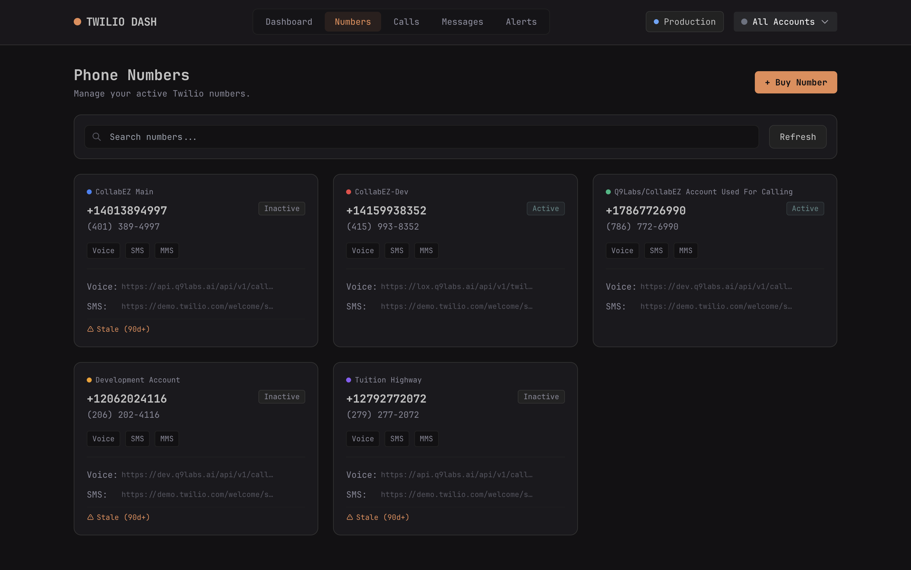

<div align="center">


# Twilio Dashboard

**Modern multi-account Twilio management platform**

[](https://www.typescriptlang.org/)
[](https://react.dev/)
[](https://bun.sh/)
[](https://opensource.org/licenses/MIT)

*Real-time monitoring • Cost analytics • Multi-account switching • Activity feeds*

[Features](#-features) • [Quick Start](#-quick-start) • [API](#-api) • [Screenshots](#-screenshots)

</div>

---

## ✨ Features

<table>
<tr>
<td width="50%">

### 📊 Multi-Account Management
Switch between Twilio accounts instantly with color-coded badges and unified views.

### 📞 Real-Time Activity
Live feed of calls and messages across all accounts with status tracking.

### 💰 Cost Analytics
Track spending with flexible time periods (7d/30d/90d/all) and detailed breakdowns.

</td>
<td width="50%">

### 🔢 Number Management
Monitor active phone numbers and detect stale/unused numbers automatically.

### ⚡ Webhooks & Alerts
Configure webhooks and view system alerts in one place.

### ⌨️ Power User Features
Keyboard shortcuts (press `?`), dark theme, and responsive design.

</td>
</tr>
</table>

## 🛠️ Tech Stack

<div align="center">

| Layer    | Technologies                                                                                          |
| -------- | ----------------------------------------------------------------------------------------------------- |
| **Frontend** |     |
| **Backend**  |    |

</div>

## 🚀 Quick Start

### Prerequisites

- [Bun](https://bun.sh) runtime installed
- Twilio account with SID and Auth Token

### Installation

```bash
# Clone the repository
git clone https://github.com/hhushhas/twilio-dash.git
cd twilio-dash

# Install dependencies
bun install
```

### Configuration

Create `accounts.json` in the root directory:
```json
{
  "defaultStaleAfterDays": 30,
  "accounts": [
    {
      "id": "prod",
      "name": "Production",
      "sid": "ACxxxxxxxxxxxxxxxxxxxxxxxxxxxxxxxxxx",
      "token": "your_auth_token_here",
      "staleAfterDays": 45
    }
  ]
}
```

| Field                | Description                          |
| -------------------- | ------------------------------------ |
| `defaultStaleAfterDays` | Global threshold for stale numbers (default: 30) |
| `staleAfterDays`     | Per-account override (optional)      |

### Running the Application

```bash
# Development mode (recommended)
bun start          # Runs both server + frontend

# Or run separately
bun run server     # Backend → http://localhost:3001
bun run dev        # Frontend → http://localhost:5173

# Production build
bun run build
```

The dashboard will be available at `http://localhost:5173` 🎉

## 🔒 Security

Sensitive files are automatically ignored:

```
✓ accounts.json     # Twilio credentials
✓ .env              # Environment variables
✓ *.log             # Log files
✓ node_modules/     # Dependencies
```

> ⚠️ **Never commit credentials to version control**

## 📁 Project Structure

```
src/
├── components/     # UI components
├── context/        # Account, Toast contexts
├── hooks/          # useKeyboardShortcuts
└── pages/          # Dashboard, Calls, Messages, etc.

server/
├── routes/         # API endpoints
└── index.ts        # Hono app + Twilio client cache
```

## 🔌 API Reference

<details>
<summary><b>View all endpoints</b></summary>

| Endpoint                         | Description                          |
| -------------------------------- | ------------------------------------ |
| `GET /api/accounts`              | List accounts (credentials excluded) |
| `GET /api/stats`                 | Dashboard statistics                 |
| `GET /api/numbers`               | Phone numbers with filters           |
| `GET /api/calls`                 | Call logs and history                |
| `GET /api/messages`              | Message logs and history             |
| `GET /api/alerts`                | System alerts and notifications      |
| `GET /api/costs?period=30d`      | Cost breakdown by period             |
| `GET /api/staleness`             | Stale number detection               |
| `GET /api/webhooks`              | Webhook configurations               |
| `GET /api/health`                | Health check endpoint                |

**Headers:**
- `X-Twilio-Account: <account-id>` - Target specific account (defaults to first)

</details>

## 📸 Screenshots

<div align="center">

### 🎯 Phone Numbers Management



**Number tracking** | **Staleness detection** | **Search & filter** | **Account badges**

---

### 📊 Dashboard Overview

*To add the dashboard screenshot: Navigate to the Dashboard page and save a screenshot as `.github/images/dashboard.png`*

</div>

---

## ⌨️ Keyboard Shortcuts

Press `?` in the application to view all available shortcuts.

## 🤝 Contributing

Contributions are welcome! Feel free to:

- Report bugs by opening an issue
- Suggest new features
- Submit pull requests

## 📄 License

MIT © [Hasan](https://github.com/hhushhas)

---

<div align="center">

**[⬆ back to top](#twilio-dashboard)**

Made with ❤️ for the Twilio community

</div>
